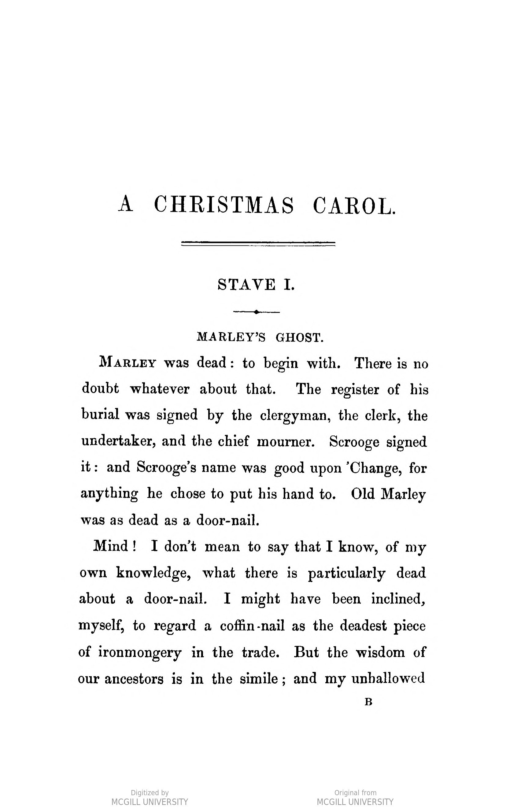

# OCR with Tesseract

## The Basics

Tesseract's default settings are set to recognize English language, use automatic page segmentation (recognizing page format and columns), and genarate a plain text file.

The simplest way to invoke tesseract :
```
tesseract myimage.jpg myimage
```

### Example: Basic OCR


Input:

```
tesseract christmas-carol-pg1.jpg christmas-carol-pg1-output
```

Result:

```
A CHRISTMAS CAROL.

STAVE I.

MARLEY’S GHOST.

Marry was dead: to begin with. There is no
doubt whatever about that. The register of his
burial was signed by the clergyman, the clerk, the
undertaker, and the chief mourner. Scrooge signed
it: and Scrooge’s name was good upon ‘Change, for
anything he chose to put his hand to. Old Marley
was as dead as a door-nail.

Mind! I don’t mean to say that I know, of my
own knowledge, what there is particularly dead
about a door-nail. I might have been inclined,
myself, to regard a coffin-nail as the deadest piece
of ironmongery in the trade. But the wisdom of

our ancestors is in the simile; and my unhallowed
B
```

## Language Parameter
For documents in languages other than English, it is often necessary to specify the language(s) or script(s). The ```-l``` flag allows you to select one or multiple languages, specified by  

Languages are specificed by codes 2-4 letters long, such as ```eng``` (English), ```fra``` (French), or ```spa``` (Spanish). 

Read more: [Tesseract: Languages & Scripts](https://github.com/tesseract-ocr/tesseract/blob/main/doc/tesseract.1.asc#languages-and-scripts)

### Example: Set language parameter


```
tesseract cyrano_fra_cover.jpg cyrano_fra_cover_out -l fra
```

Result:
```
EDMOND ROSTAND

CYRANO

COMÉDIE HÉROÏQUE EN CINQ ACTES
EN VERS

Représentée à Paris, sur le Théâtre de la Porte Saint-Martin,
le 28 décembre 1897

 

NEw YorK
WILLIAM R. JENKINS
ÉDITEUR ET LIBRAIRE FRANÇAIS
851 & 853 SIXTH AVENUE

cl
```

Use Lang+Lang for multilingual documents:
```
tesseract cyrano_fra_cover.jpg cyrano_fra_cover_out -l fra+eng
```

## Page Segmentation Modes (PSM)
Page segmentation refers to the structure of the text on the file, whether the page contains a single block of text, columns, a single word, a word in a circle, etc. Tesseract assumes a single block of text. You can improve text detection by manually setting the page segmentation mode. 

```
Page segmentation modes:
  0    Orientation and script detection (OSD) only.
  1    Automatic page segmentation with OSD.
  2    Automatic page segmentation, but no OSD, or OCR. (not implemented)
  3    Fully automatic page segmentation, but no OSD. (Default)
  4    Assume a single column of text of variable sizes.
  5    Assume a single uniform block of vertically aligned text.
  6    Assume a single uniform block of text.
  7    Treat the image as a single text line.
  8    Treat the image as a single word.
  9    Treat the image as a single word in a circle.
 10    Treat the image as a single character.
 11    Sparse text. Find as much text as possible in no particular order.
 12    Sparse text with OSD.
 13    Raw line. Treat the image as a single text line,
       bypassing hacks that are Tesseract-specific.
```

Resource: [Page segmentation modes explained with clear examples](https://pyimagesearch.com/2021/11/15/tesseract-page-segmentation-modes-psms-explained-how-to-improve-your-ocr-accuracy/)

### Example: Improve text detection with PSM

The following example contains a list of characters in two columns.


The default page segmentation mode (```--psm 3```) is fully automated. In this instance, the automated psm fails to recognize the columns on the page. Each character should be listed on its own line.

Input:

```
 tesseract cyrano_eng_persons.jpg cyrano_eng_persons_default
```

Output:
```
THE PERSONS

Cyrano pE Brrorrac The Porter
CurisTIAN DE Ngvuvittetre A Citizen

Comre pr GuICHE His Son
RacuENEAU A Cut-Purse

Lz Brer A Spectator
Carson bE Casret-JaLoux A Sentry

The Cadets Bertrandou the Fifer
LicntbRE A Capuchin
VicoMTE DE VALVERT Two Musicians

A Marouts The Poets

Second Marquis The Pastrycooks
Third Marquis The Pages
Montfleury Roxane

Bellerose Her Dusnna
Jodelet Lisz

Cuicy Tue Orance-Gi
BRIssAILLE Moruer MarcufrirTs DE Jésus
A Meddler StsreR MARTHE

A Musketeer StsTER CLAIRE
Another Musketeer An Actress

A Spanish Officer A Soubrette

A Cavalier The Flower-Girl

The Crowd, Citizens, Marquis, Musketeers, Thieves, Pas-
trycooks, Poets, Cadets of Gascoyne, Actors, Violins, Pages,
Children, Spanish Soldiers, Spectators, Intellectuals, Acade-
micians, Nuns, etc.
```

On this document, PSM 11 (Sparse Text: Find as Much Text as Possible in No Particular Order) did the trick. 


Input:

```
 tesseract cyrano_eng_persons.jpg cyrano_eng_persons_default --psm 11
```

Output:
```
THE PERSONS

Cyrano pE Brrorrac

The Porter

CuristTIAN DE NEUVILLETTE

A Citizen

His Son

Comte pr GuicHE

RacuENEAU

A Cut-Purse

Le Brer

A Spectator

Carson DE CasTEL-JALOUX

A Sentry

The Cadets

Bertrandou the Fifer

LicnizRE

A Capuchin

Two Musicians

VicoMTE DE VALVERT

A Marouts

The Poets

Second Marquis

The Pastrycooks

Third Marquis

The Pages

Montfleury

Roxang

Bellerose

Her Dusnna

Lisz

Jodelet

Cuicy

Tue Orancz-Girt

BrissAILLE

Moruer MarcufrirTs DE Jésus

A Meddler

Sister MARTHE

A Musketeer

StsTER CLAIRE

Another Musketeer

An Actress

A Soubrette

A Spanish Officer

A Cavalier

The Flower-Girl

The Crowd, Citizens, Marquis, Musketeers, Thieves, Pas-

trycooks, Poets, Cadets of Gascoyne, Actors, Violins, Pages,

Children, Spanish Soldiers, Spectators, Intellectuals, Acade-

micians, Nuns, etc.

```